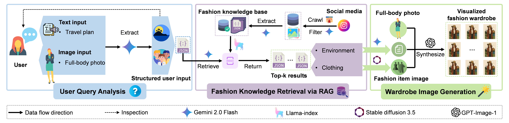
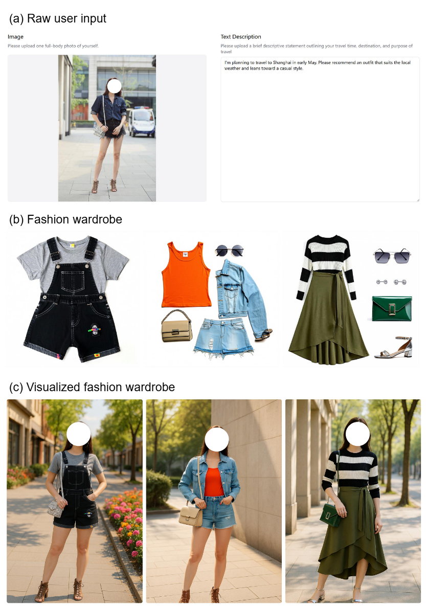
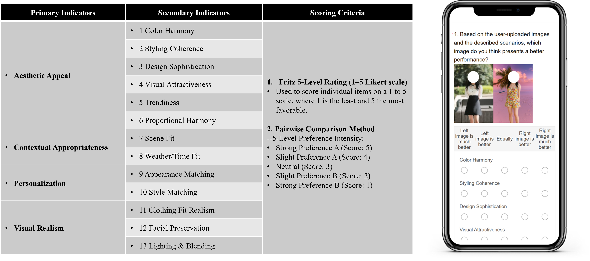

# GenWardrobe: A Fully Generative System for Travel Fashion Wardrobe Construction

## Overview
**GenWardrobe** is end-to-end system that understands ‘human–complex context constraint–fashion knowledge’ to generate travel fashion wardrobes.

**Figure 1.** Illustration of the overall system design.

## System Design
- **👤 User Query Analysis**
- **🔍 Fashion Knowledge Retrieval via RAG**
- **🖼️ Wardrobe Image Generation**

## Fashion knowledge
- We leverage an RAG framework to obtain a set of fashion knowledge from a well-curated large-scale fashion knowledge base. The extraction principles of fashion knowledge are illustrated in Figure 2

**Figure 2.** Fashion knowledge extraction from the image.

## Getting Started
### Key Steps
1. Add your API_KEY in [config.py](config.py).
2. Start the backend with Flask to receive POST requests for generation.
3. Front-end and back-end interaction with user photo and scene description upload on the Front-end.
4. Run [app.py](app.py) to execute the entire pipeline.
###  System Functions & Modules
Preparing, coming soon...

## Dataset  
Preparing, coming soon...

## Demo
### Illustration
- To showcase the end-to-end workflow of the system, we built an interactive demonstration, where the raw user input consists of a full-body photo and a travel plan text. The demonstration outputs both a pure fashion wardrobe and visualized fashion wardrobe.

**Figure 3.** Illustration of the interface of the demo system.

### Processing Time
- After the user uploads the raw input, the system first calls the Gemini 2.0 Flash API to extract relevant information, which takes approximately **1 second**.
- Once the user information is obtained, the system utilizes it to retrieve the top-k most relevant JSON files from the database using the Gemini 2.0 Flash API, a process that takes around **15 seconds**.
- With the top-k JSON files, the system then generates both the pure fashion wardrobe and the visualized fashion wardrobe using the Stable Diffusion 3.5 Large, Gemini 2.0 Flash, and GPT-Image-1 APIs. Each JSON file takes approximately **20 seconds** to process.

## Evaluation
- To validate the professionalism and practicality of the generated recommendations, we conducted a double-blind expert evaluation experiment. Six experts in the field of fashion design were invited to anonymously evaluate two sets of outfit recommendation images: those generated by the proposed system and those produced without using it. The evaluation was conducted using a combination of pairwise comparison and anchored rating scales.
### Test Input
- To verify the effectiveness of the system across different task scenarios, we tested a variety of input cases, as listed below:
1. General Travel Scenario
- Example: I plan to travel to Phuket in early May. Please recommend suitable outfits, preferably in a casual style.
2. Formal Event Scenario
- Example: I have a business meeting in Singapore in June. Please recommend appropriate attire for a formal indoor setting.
3. Leisure and Outdoor Activity Scenario
- Example: I plan to visit a park to enjoy the flowers this weekend. Please recommend some suitable outfits.
4. Daily/Commuting Scenario
- Example: Please recommend an outfit suitable for daily commuting in summer in Shanghai.
5. Multi-task Scenario
- Example: I will travel to Bali in July for about three days, and then attend a wedding in London. Please recommend outfits for both occasions.
### Evaluation Metrics
- To ensure the accuracy of the evaluation, we invited experts in the fashion field to develop corresponding evaluation scales and methods, as shown in the figure below.

**Figure 4.** Evaluation_metrics.

### Results
- The average score across all comparisons was +1.146 (indicating a preference between “better” and “much better”), and statistical analysis confirmed a significant advantage in both aesthetic quality and contextual relevance.

**Figure 5.** Evaluation_result.

## Contact
For questions or collaborations, please contact:
[Peng Jin]
[nlxxnlgz1@gmail.com]
