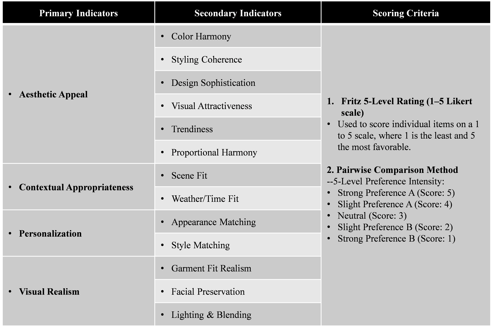

# GenWardrobe: A Fully Generative System for Travel Fashion Wardrobe Construction

## Overview
**GenWardrobe** is an end-to-end fashion recommendation system that supports:
- **Multimodal input**: combines both user-uploaded images and textual descriptions.
- **Contextual understanding**: models user appearance and real-world scenarios (e.g., travel, work, leisure).
- **Structured retrieval**: retrieves relevant outfit components based on semantic matching.
- **Try-on image generation**: generates realistic try-on images using state-of-the-art generative models.
- It is designed to help users visualize complete outfit suggestions tailored to their real-world travel or task-based scenarios.

## System Design
- **Database Construction**: The Gemini model is employed to perform parallel filtering and feature extraction on raw image data.
- **User Input and Information Parsing**: Users upload full-body images and provide travel-related information through the interface.
- **Index Construction and Retrieval**: A vector index is built using the LlamaIndex framework. High-dimensional feature matching is performed based on semantic representations of environmental context and personal attributes, retrieving multiple records that best match the user's input.
- **Image Generation and Fusion**

## Getting Started
### Key Steps for Realistic Dressing
1. Add your API_KEY in [config.py](config.py).
2. Start the backend with Flask to receive POST requests for generation.
3. Front-end and back-end interaction with user photo and scene description upload on the Front-end.
4. Run [app.py](app.py) to execute the entire pipeline.
###  System Functions & Modules
Preparing, coming soon...

## Dataset  
Preparing, coming soon...

## Evaluation
- To validate the professionalism and practicality of the generated recommendations, we conducted a double-blind expert evaluation experiment. Six experts in the field of fashion design were invited to anonymously evaluate two sets of outfit recommendation images: those generated by the proposed system and those produced without using it. The evaluation was conducted using a combination of pairwise comparison and anchored rating scales.
### Test Input
- To verify the effectiveness of the system across different task scenarios, we tested a variety of input cases, as listed below:
1. General Travel Scenario
- Example: I plan to travel to Phuket in early May. Please recommend suitable outfits, preferably in a casual style.
2. Formal Event Scenario
- Example: I have a business meeting in Singapore in June. Please recommend appropriate attire for a formal indoor setting.
3. Leisure and Outdoor Activity Scenario
- Example: I plan to visit a park to enjoy the flowers this weekend. Please recommend some suitable outfits.
4. Daily/Commuting Scenario
- Example: Please recommend an outfit suitable for daily commuting in summer in Shanghai.
5. Multi-task Scenario
- Example: I will travel to Bali in July for about three days, and then attend a wedding in London. Please recommend outfits for both occasions.
### Evaluation Metrics
- To ensure the accuracy of the evaluation, we invited experts in the fashion field to develop corresponding evaluation scales and methods, as shown in the figure below.

### Results
- The expert assessment results showed that, on a five-point rating scale, the outfit recommendation images generated by our system received scores that were xx\% higher on average than those of the control group. All results were analyzed using fuzzy clustering and statistical significance testing, confirming that the proposed system outperforms traditional recommendation methods across multiple evaluation dimensions.

## Contact
For questions or collaborations, please contact:
[Peng Jin]
[nlxxnlgz1@gmail.com]
